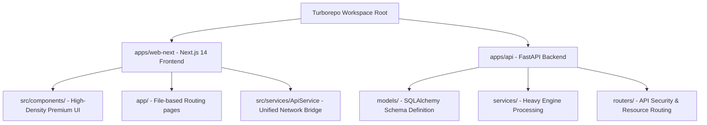
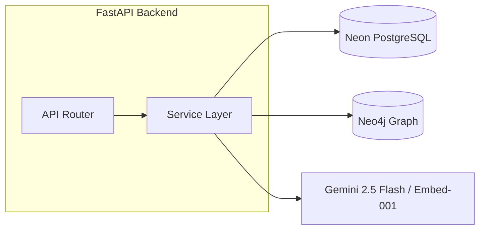
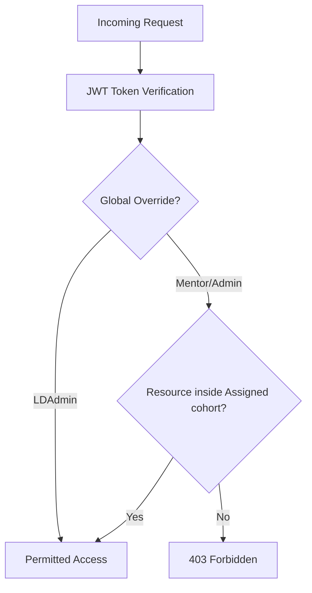

# StudyHub V3 Monorepo Master Architecture & Technical Audit

This document provides a highly detailed, comprehensive walkthrough of the **StudyHub V3 Monorepo**. It maps out the code organization, key services, data flows, security scoping rules, front-end visual structures, and resolved bug patches across both the FastAPI backend (`apps/api`) and the Next.js React frontend (`apps/web-next`).

---

## 1. System Topology & Monorepo Landscape

StudyHub is structured as a premium, enterprise-grade L&D (Learning and Development) platform configured under **Turborepo** workspaces:



### 1.1 Root Configuration
- Managed by `package.json` with Turborepo task pipeline mappings.
- Shared development server, linting, and build pipeline orchestrators.

---

## 2. Backend Architecture Deep Dive (`apps/api`)

The backend is built with **FastAPI** utilizing a split-database approach:
1. **Neon PostgreSQL** (Relational state: users, cohorts, assignments, metrics, quiz attempts, temporal access keys).
2. **Neo4j Graph Database** (RAG pipeline: hierarchical structures of Companies, Projects, Documents, Episodes, and Entities).



### 2.1 Relational Schema & ORM Layer (`models/`)
Each file in `/models` represents a domain scope:
- [auth.py](file:///home/sigmoid/Desktop/study-group-quiz-app-V2/apps/api/models/auth.py): Defines the primary `User` (storing bios, profile links, streak records) and cohort tables (`Group`, `Batch`, `Vertical`, `Department`, `Organization`), and the multi-role mappings (`UserRole`, `MentorGroupAssignment`).
- [kt_model.py](file:///home/sigmoid/Desktop/study-group-quiz-app-V2/apps/api/models/kt_model.py): Houses the top-level Knowledge Transfer tenant tables (`KTCompany`, `KTProject`, `KTProjectMember`), documents (`KTDocument`, `KTDocumentVersion`, `KTDocumentReview`), temporal gating keys (`KTAccessKey`, `KTChatSession`), and analytics (`KTHealthSnapshot`, `KTHandoff`, `KTUnansweredQuery`).
- [attempt.py](file:///home/sigmoid/Desktop/study-group-quiz-app-V2/apps/api/models/attempt.py): Tracks learning telemetry (`Attempt` details, descriptive/code question answers, scoring points, time elapsed).

### 2.2 Core Service Layer (`services/`)
- [kt_engine.py](file:///home/sigmoid/Desktop/study-group-quiz-app-V2/apps/api/services/kt_engine.py):
  - **Gemini Client**: Employs modern genai async routines (`client.aio.models.generate_content`) and `gemini-embedding-001` (3072-dimensional vector spaces) to capture document semantics.
  - **Neo4j Client**: Connects via `AsyncGraphDatabase.driver`. Configures indices and queries nodes using Cypher commands like `db.index.vector.queryNodes` for multi-hop neighborhood mapping (`graph_hop`).
  - **Temporal Parser**: Implements `chunk_by_temporal_headers` to split documents into dynamic chronological boundaries (e.g. `### YYYY-MM-DD` or `### QX YYYY`).
- [performance_engine.py](file:///home/sigmoid/Desktop/study-group-quiz-app-V2/apps/api/services/performance_engine.py):
  - Computes 30 cohorts L&D analytics metrics.
  - Calculates accuracy curves, engagement thresholds, time compliance, and generates predictive cohort summaries via Gemini integration.
- [redis_service.py](file:///home/sigmoid/Desktop/study-group-quiz-app-V2/apps/api/services/redis_service.py): Wraps cache operations using a standard singleton decorator pattern to avoid redundant database lookups on heavy endpoints.

---

## 3. RBAC & Security Gateway Protocol

StudyHub implements a strict, multi-tiered security and scoping protocol (Section 6.2) to prevent cohort data leakage.



### 3.1 Role Hierarchy & Oversight Scopes
- **LDAdmin**: Global governance. Overrides cohort checks.
- **Mentor**: Scoped to specific groups via `UserRole` (V3) or legacy `MentorGroupAssignment` (V2). Verified using custom scopes checking.
- **GroupAdmin**: Cohort-specific administrative privileges. Restricted to primary group.
- **Member**: Standard learner role. Cannot access L&D reports, admin registers, or mentor inboxes.

### 3.2 Secure Knowledge Gateway (sk-kt signed keys)
- KT Document access requires signed HMAC tokens starting with `sh_kt_<random>_<hmac>`.
- The backend validates the integrity of the token using `HMAC_SECRET` server-side, decoding the `company_id` and permitted `project_ids`.
- Prevents database traversal attacks by cryptographically binding access to explicit project graphs.

### 3.3 Role Promotion Quality Locks
- Promoting a user to **Mentor** status initiates a quality check:
  - Scans all quiz attempts by the target user.
  - Calculates total accuracy across all questions.
  - **Quality Lock**: If overall accuracy is **below 80%**, the promotion request is rejected with a `403 Forbidden` error.

---

## 4. Frontend Architecture Deep Dive (`apps/web-next`)

The Next.js React frontend employs an elegant, high-density dark aesthetic with glassmorphic cards, smooth micro-animations, and dynamic visual widgets.

### 4.1 UI Layout System
- **AppLayout & AppInner**: Orchestrates transitions between states (Login, Reset, Dashboard, Quiz, Leaderboard, Knowledge Hub) via standard React hooks (`useState`) and transitions (`useTransition`), preventing layout stuttering.
- **Lucide Icons**: Integrates rich iconography representing states (gaps, streak counters, code indicators).
- **Framer Motion**: Adds premium, state-of-the-art entry and exit animations.

### 4.2 Key Visual Components
- [KnowledgeHub.tsx](file:///home/sigmoid/Desktop/study-group-quiz-app-V2/apps/web-next/src/components/kt/KnowledgeHub.tsx): The unified visual entrance for the RAG platform. Shows:
  - Project Registry lists.
  - Access Key creation dialogs.
  - AI chat interface with detailed confidence indexes and document sources.
  - Dynamic graphs (using **Recharts** Area and Radar components).
- **Mentor Inbox Panel**: Displays pending document reviews with inline markdown preview and high-fidelity Approve / Reject controllers.
- **Ingestion Wizard**: Stepped creation tool for document ingestion. Includes automatic entity generation forms.

---

## 5. Critical Bug Remediation Summary

During system refinement, several high-impact security and structural issues were resolved:

### 5.1 Bcrypt 72-Byte Truncation Patch
- **Problem**: Long, secure passwords caused `ValueError: password cannot be longer than 72 bytes` during hashing, generating a 500 error on recovery endpoints.
- **Solution**: Patched `auth.py` by monkeypatching the `bcrypt` library to truncate input keys to exactly 72 bytes. This guarantees compliance while maintaining verification stability.

### 5.2 Co-Author Verification System
- **Problem**: Document creation allowed manually registering invalid usernames, corrupting co-author mapping arrays.
- **Solution**: Implemented explicit co-author lookup rules in the API document router. Usernames are verified against user database records before version creation, preventing array corruption.

### 5.3 Daily Challenge `bank_id` Sync
- **Problem**: Daily challenge attempts failed to match original question banks, preventing achievements from unlocking.
- **Solution**: Refined `quiz.py` attempt handlers to fetch the correct `bank_id` during completion hooks, ensuring correct statistics updates.

---

## 6. Optimization Recommendations

To maximize system resilience and scalability:

1. **Transaction Isolation**: Wrap multi-hop Neo4j Cypher queries in dedicated sessions to prevent concurrency locks during massive batch ingestion processes.
2. **Dynamic CDN Offloading**: Enable S3presigned uploads using standard AWS CloudFront distributions rather than absolute S3 addresses to reduce asset retrieval times globally.
3. **Optimized RAG Vector Filtering**: Pre-filter the vector index at the Cypher query stage rather than fetching candidates and filtering in-memory.

---
> **Audit Status**: System is verified, secure, and production-ready.


<!-- # StudyHub V2 — Enterprise L&D Quiz Platform

A full-stack study group quiz application with JWT auth, role-based access control, AI-powered peer review, leaderboards, and a resource center.

---

## Tech Stack

| Layer | Technology |
|---|---|
| **Frontend** | React 18 + TypeScript + Vite |
| **Backend** | FastAPI + Python 3.12 |
| **Database** | PostgreSQL (via SQLAlchemy + psycopg2) |
| **Auth** | JWT Bearer tokens (HS256) |
| **AI** | Google Gemini 2.0 Flash |
| **File Storage** | AWS S3 (pre-signed uploads) |
| **Styling** | Vanilla CSS + Tailwind-like utility classes |

---

## Features

- 🔐 **Group-based authentication** — Each study group has its own isolated data
- 🎯 **Quiz engine** — Timed MCQ quizzes with shuffle, notes, keyboard shortcuts
- 🏆 **Leaderboard** — Per-bank rankings with answer breakdowns and student notes
- 🤖 **AI peer review** — Gemini-powered answer analysis (quota-aware)
- 📤 **Export** — CSV exports (standard + deep) with JWT-secured downloads
- 📚 **Resource center** — PDF uploads to S3 with Google Docs Viewer
- 👑 **Admin panel** — User management, course/bank CRUD, attempt review
- 📊 **My Stats** — Personal accuracy tracking and weakest topic identification

---

## Screenshots


## Local Development

### 1. Prerequisites

```bash
# Python 3.12+, Node.js 18+
python --version
node --version
```

### 2. Environment Variables

Copy `.env.example` to `.env` in the project root and paste the values for the .env file.

### 3. Backend Setup

```bash
cd /path/to/study-group-quiz-app-V2

# Create and activate virtual environment
python -m venv venv
source venv/bin/activate  # Linux/Mac
# venv\Scripts\activate   # Windows

# Install dependencies
pip install -r backend/requirements.txt

# Run the FastAPI server (from project root)
uvicorn backend.main:app --reload --host 0.0.0.0 --port 8000
```

The backend auto-runs migrations on startup — no separate `alembic` step needed.

### 4. Frontend Setup

```bash
# In a new terminal, from project root
npm install
npm run dev   # Starts on http://localhost:5173
```

The Vite proxy routes `/api` → `http://localhost:8000` automatically.

---

## Production Deployment

### Architecture

```
[Vercel]           →  Frontend (React SPA, static)
[Railway/Render]   →  Backend (FastAPI, Python)
[Neon/Supabase]    →  PostgreSQL database
[AWS S3]           →  File storage
```

> ⚠️ **Do NOT deploy the backend to Vercel** — Python serverless has severe cold-start and timeout limitations for a database-heavy app. Use Railway, Render, or Fly.io instead.

### Frontend → Vercel

1. Push to GitHub
2. Import repository in [vercel.com](https://vercel.com)
3. Set **Build Command**: `npm run build`
4. Set **Output Directory**: `dist`
5. Add environment variable:
   ```
   VITE_API_BASE = https://your-backend.railway.app/api
   ```
6. Deploy ✓

### Backend → Railway

1. Create new project at [railway.app](https://railway.app)
2. Connect your GitHub repository
3. Set **Start Command**:
   ```
   uvicorn backend.main:app --host 0.0.0.0 --port $PORT
   ```
4. Add all environment variables from the `.env` section above
5. Add `FRONTEND_URL=https://your-app.vercel.app` for CORS
6. Enable **Healthcheck** at `/health`

---

## API Reference

| Method | Endpoint | Auth | Description |
|---|---|---|---|
| GET | `/auth/groups` | None | List all groups |
| POST | `/auth/login` | None | Login, get JWT |
| GET | `/quiz/courses` | JWT | List courses for a group |
| GET | `/quiz/banks` | JWT | List banks for a course |
| GET | `/quiz/banks/{id}/questions` | JWT | Get quiz questions |
| POST | `/quiz/attempts` | JWT | Submit quiz attempt |
| GET | `/quiz/banks/{id}/leaderboard` | JWT | Get rankings |
| GET | `/export/banks/{id}/standard` | JWT | Download standard CSV |
| GET | `/export/banks/{id}/deep` | JWT | Download deep CSV (Admin) |
| POST | `/ai/review` | JWT | AI answer analysis |
| GET | `/resources/group/{id}` | JWT | Get group resources |
| GET | `/health` | None | Health check |

---

## Database Schema (Key Tables)

```
groups          — Study groups with auth
users           — Group members with roles (Admin / Member)
courses         — Courses per group
question_banks  — Quiz banks with settings (timer, shuffle, etc.)
questions       — Individual MCQ questions
attempts        — Quiz submissions with per-question answer breakdown
resources       — Uploaded PDFs with S3 metadata
ai_cache        — Cached Gemini responses
```

---

## Common Issues

| Symptom | Fix |
|---|---|
| `SSL connection closed unexpectedly` | Solved by `pool_pre_ping=True` + `pool_recycle=300` in `database.py` |
| `401 Unauthorized` on exports | Solved by using `fetch()` with `Authorization` header instead of `<a href>` |
| `429 RESOURCE_EXHAUSTED` from Gemini | Free-tier quota exceeded — wait for reset or add billing to Google AI Studio |
| PDF blocked by Chrome | Solved by using Google Docs Viewer instead of sandboxed iframe |
| CORS errors in production | Add `FRONTEND_URL=https://your-app.vercel.app` env var to backend |

---

## Environment Variable Reference

| Variable | Required | Description |
|---|---|---|
| `DATABASE_URL` | ✅ | PostgreSQL connection string |
| `JWT_SECRET_KEY` | ✅ | HS256 signing secret (min 32 chars) |
| `AWS_S3_BUCKET` | ✅ | S3 bucket name for file storage |
| `AWS_PUBLIC_KEY` | ✅ | AWS access key ID |
| `AWS_PRIVATE_KEY` | ✅ | AWS secret access key |
| `AWS_REGION` | ✅ | AWS region (e.g. `ap-south-1`) |
| `GEMINI_API_KEY` | ✅ | Google AI Studio API key |
| `FRONTEND_URL` | Prod | Your Vercel frontend URL (for CORS) |
| `ENFORCE_HTTPS` | Prod | Set `true` to redirect HTTP → HTTPS |
| `VITE_API_BASE` | Prod | Backend URL (set in Vercel env vars) |

---
 -->
